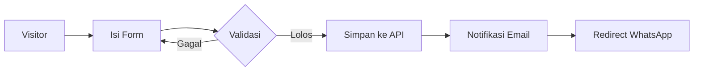

# 📄 PRD — Landing Page Kursus Bahasa Mandarin

> **Document Status:** Final  
> **Last Updated:** 2026-06-21  
> **Target Platform:** Next.js 15 + Tailwind CSS  
> **Primary Goal:** Lead generation (form → WhatsApp → closing)

---

## 1. Business Objectives

Mendapatkan *qualified leads* calon siswa yang tertarik belajar Bahasa Mandarin dan mengarahkan mereka melalui funnel konversi berikut:

1. **Visitor** mendarat di landing page
2. **Visitor** mengisi form registrasi konsultasi
3. **Data** masuk ke email / CRM (customer management system)
4. **Redirect** otomatis ke WhatsApp Sales setelah submit
5. **Sales** melakukan follow-up dan closing

### Target Conversion Rate

| Tahap | Target |
|-------|--------|
| Visitor → Form Submit | **> 5%** |
| Form Submit → WhatsApp Redirect | **> 80%** |
| WhatsApp → Closing | **> 25%** |

---

## 2. Brand Positioning

### Tagline Utama

**Kuasa Mandarin, Tanpa Tinggalkan Rumah**

> *Headline alternatif:* Belajar Bahasa Mandarin dari Nol Sampai Lancar — Tanpa Harus ke Luar Rumah

### Subheadline

Program belajar Mandarin untuk anak (4–15 tahun), pelajar, mahasiswa, karyawan, dan profesional. Tersedia kelas *online* dan *offline* dengan kurikulum terstruktur, kelas mini (3–6 siswa), dan pengajar profesional yang berpengalaman.

### Call-to-Action

| Jenis | Teks | Tujuan |
|-------|------|--------|
| **Primary CTA** | Daftar Konsultasi Gratis | Form lead |
| **Secondary CTA** | Chat WhatsApp Sekarang | Direct WA |
| **Footer CTA** | Gabung Sekarang! | WA redirect |

### Hero Stats Counter (di bawah CTA)

Tampilkan 3 angka statistik sebagai *social proof* di hero section:

| Statistik | Angka | Keterangan |
|-----------|-------|------------|
| 👥 Peserta Terdaftar | **500+** | Total siswa aktif & alumni |
| ⭐ Kepuasan Peserta | **95%** | Puas dengan metode belajar |
| 📈 Peningkatan Skill | **90%** | Merasakan kemajuan signifikan |

> *Source data:* internal CRM. Angka bisa disesuaikan.

### Tone & Voice

| Atribut | Keterangan |
|---------|------------|
| **Profesional** | Menyampaikan kredibilitas dan kepercayaan |
| **Empatik** | Memahami kesulitan calon siswa |
| **Solutif** | Menawarkan jalan keluar yang jelas |
| **Inklusif** | Menjangkau semua segmen usia & latar belakang |
| **Prestisius** | Menekankan peluang global (karier, studi, bisnis) |

---

## 3. User Persona

### Persona A — Pelajar / Mahasiswa

| Atribut | Detail |
|---------|--------|
| Usia | 15–24 tahun |
| Tujuan | Persiapan HSK, beasiswa, studi ke China |
| Pain Point | Kesulitan menghafal Hanzi, tidak ada bimbingan |
| Motivasi | Lulus ujian, dapat beasiswa |

### Persona B — Profesional / Karyawan

| Atribut | Detail |
|---------|--------|
| Usia | 25–40 tahun |
| Tujuan | Komunikasi bisnis, kenaikan karier |
| Pain Point | Waktu terbatas, takut praktik bicara |
| Motivasi | Promosi, ekspansi karier |

### Persona C — Pebisnis

| Atribut | Detail |
|---------|--------|
| Usia | 30–50 tahun |
| Tujuan | Negosiasi dengan mitra China |
| Pain Point | Tidak bisa bahasa, bergantung penerjemah |
| Motivasi | Efisiensi bisnis, hubungan lebih baik |

---

## 4. Struktur Landing Page

**Urutan Section (dari atas ke bawah):**

| # | Section | Tujuan |
|---|---------|--------|
| 1 | **Hero** (4.1) | Hook + CTA utama + social proof (stats) |
| 2 | **Problem** (4.2) | Identifikasi pain point calon siswa |
| 3 | **Why Learn** (4.3) | Persuasi — kenapa harus belajar Mandarin |
| 4 | **Solution** (4.4) | Tawarkan solusi terstruktur |
| 5 | **Why Us** (4.7) | Unique value props (kelas mini, fleksibel, dll) |
| 6 | **Program** (4.6) | Detail 7 program belajar |
| 7 | **Benefit** (4.8) | Yang akan didapatkan siswa |
| 8 | **Guru** (4.9) | Profesionalisme pengajar |
| 9 | **Kelas Online** (4.10) | 3 metode belajar online |
| 10 | **Testimonial** (4.11) | Social proof + video review |
| 11 | **Trust** (4.12–4.13) | Perusahaan + media coverage |
| 12 | **Galeri** (4.14) | Dokumentasi kegiatan |
| 13 | **Lokasi** (4.15) | Cabang & alamat |
| 14 | **FAQ** (4.16) | Mengurangi keraguan |
| 15 | **Lead Form** (4.17) | Primary conversion |
| 16 | **Footer CTA** (4.18) | Last call to action |
| 17 | **Blog** (4.19) | Content marketing |
| — | **Sticky CTA** (selalu ada) | Floating WhatsApp |

---

### 4.1 Hero Section

| Elemen | Deskripsi |
|--------|-----------|
| **Layout** | Kiri: Copy + Stats · Kanan: Visual (foto siswa/guru mengajar) |
| **Headline** | Kuasai Bahasa Mandarin Tanpa Harus Keluar Rumah |
| **Subheadline** | Mulai dari nol hingga mampu berbicara, membaca, dan memahami Bahasa Mandarin — untuk kebutuhan sekolah, karier, bisnis, maupun persiapan studi ke China/Taiwan. Kelas online interaktif dengan pengajar profesional. |
| **CTA 1** | Daftar Konsultasi Gratis |
| **CTA 2** | Chat WhatsApp |

**Stats Counter** (di bawah CTA, tampilkan 3 kolom sejajar):

```
┌─────────────┐  ┌─────────────┐  ┌──────────────┐
│   500+      │  │    95%      │  │     90%      │
│ Peserta     │  │ Peserta     │  │ Peningkatan  │
│ Terdaftar   │  │ Puas        │  │ Ketrampilan  │
└─────────────┘  └─────────────┘  └──────────────┘
```

**Trust Badges** (di bawah stats):
| Badge | Makna |
|-------|-------|
| 🎓 Pengajar Berpengalaman | Guru native & bilingual bersertifikat |
| 🏠 Kelas Online & Offline | Fleksibel, dari rumah atau tatap muka |
| 📚 Materi Terstruktur | Kurikulum jelas dari dasar hingga mahir |
| ⏰ Jadwal Fleksibel | Pilih weekday / weekend, sesuaikan jadwal |

---

### 4.2 Problem Section — *"Mengapa Banyak Orang Gagal Belajar Mandarin?"*

| Masalah | Deskripsi |
|---------|-----------|
| **Sulit Menghafal Hanzi** | Banyak siswa tidak memiliki metode belajar yang tepat |
| **Tidak Percaya Diri Berbicara** | Sering memahami teori tetapi takut praktik |
| **Belajar Tidak Konsisten** | Tidak ada kurikulum dan pendampingan yang jelas |
| **Materi Berantakan** | Belajar dari banyak sumber tanpa arah |

---

### 4.3 Why Learn Mandarin? — *"Alasan Kenapa Harus Belajar Bahasa Mandarin"*

Section persuasif yang menjelaskan *mengapa* pengunjung HARUS belajar Mandarin sekarang.

| Alasan | Icon | Penjelasan |
|--------|------|------------|
| 🌏 Bahasa Paling Banyak Digunakan | Globe | Mandarin adalah bahasa dengan jumlah penutur terbanyak di dunia — lebih dari 1,2 miliar orang |
| 📈 China Pemain Ekonomi Global | Chart | China memegang peran penting dalam ekonomi dunia dan perdagangan internasional |
| 🤝 Investor Terbesar di Indonesia | Handshake | Mayoritas investor asing di Indonesia adalah perusahaan China |
| 💼 Peluang Karir & Bisnis | Briefcase | Kemampuan Mandarin membuka kesempatan karir dan bisnis yang sangat luas, dari entry-level hingga eksekutif |

---

### 4.4 Solution Section — *"Solusi Belajar Mandarin yang Terstruktur"*

Kami membantu siswa belajar Mandarin secara sistematis — mulai dari dasar hingga mahir — dengan metode yang mudah dipahami dan fokus pada praktik komunikasi.

| Fitur | Manfaat |
|-------|---------|
| Kurikulum Bertahap | Dari pinyin → Hanzi → percakapan |
| Latihan Percakapan Aktif | Speaking practice setiap sesi |
| Evaluasi Perkembangan | Progress report berkala |
| Materi Digital Lengkap | Akses 24/7 via platform |
| Pengajar Berpengalaman | Native & bilingual trainer |
| Grup Diskusi Siswa | Belajar bareng komunitas |

---

### 4.6 Program Section — *"Program Kami"*

#### 1️⃣ Mandarin untuk Anak *(Usia 4–15 tahun)*

| Atribut | Detail |
|---------|--------|
| **Target** | Anak-anak, persiapan sejak dini |
| **Materi** | Pengenalan Hanzi · Percakapan dasar · Lagu & game interaktif · Pinyin |
| **Metode** | Fun learning — bermain sambil belajar |
| **Output** | Mampu percakapan sehari-hari, nilai sekolah meningkat |

#### 2️⃣ Mandarin untuk Dewasa

| Atribut | Detail |
|---------|--------|
| **Target** | Karyawan, profesional, umum |
| **Materi** | Pinyin · Hanzi · Percakapan · Listening · Writing |
| **Durasi** | 3–6 bulan |
| **Output** | Mampu komunikasi aktif untuk kerja & sosial |

#### 3️⃣ Mandarin Bisnis

| Atribut | Detail |
|---------|--------|
| **Target** | Profesional, pebisnis, karyawan perusahaan China |
| **Materi** | Komunikasi bisnis · Presentasi · Negosiasi · Istilah industri |
| **Durasi** | 4–8 bulan |
| **Output** | Mampu rapat & negosiasi dengan mitra China |

#### 4️⃣ Program Private *(Semua Usia)*

| Atribut | Detail |
|---------|--------|
| **Target** | Semua usia — 1 guru 1 murid |
| **Materi** | Disesuaikan dengan kebutuhan & level peserta |
| **Keunggulan** | Jadwal fleksibel, fokus penuh, belajar lebih cepat |
| **Output** | Target personal tercapai lebih efisien |

#### 5️⃣ Persiapan Kuliah di Taiwan / China

| Atribut | Detail |
|---------|--------|
| **Target** | Siswa yang ingin melanjutkan studi ke Taiwan/China |
| **Materi** | Traditional Mandarin (Taiwan) / Simplified Mandarin (China) · Akademik · Percakapan kampus |
| **Output** | Siap mengikuti perkuliahan di Taiwan/China |

#### 6️⃣ Persiapan Ujian HSK

| Atribut | Detail |
|---------|--------|
| **Target** | Beasiswa, studi, sertifikasi |
| **Materi** | Simulasi ujian · Bank soal HSK 1–6 · Strategi pengerjaan |
| **Durasi** | 2–6 bulan per level |
| **Output** | Lulus HSK sesuai target level |

#### 7️⃣ Company Training

| Atribut | Detail |
|---------|--------|
| **Target** | Perusahaan / korporasi |
| **Materi** | Disesuaikan dengan kebutuhan industri perusahaan |
| **Keunggulan** | Jadwal & lokasi fleksibel (bisa di kantor atau online) |
| **Output** | Karyawan mampu komunikasi bisnis Mandarin |

---

### 4.7 Why Us Section — *"Mengapa Harus Belajar di Sini?"*

| Keunggulan | Icon | Penjelasan |
|------------|------|------------|
| 📋 **Program Fleksibel** | Customizable | Setiap program dapat menyesuaikan dengan kebutuhan & kemampuan siswa — dari anak-anak hingga eksekutif |
| 👥 **Kelas Mini** | Mini Group | Hanya 3–6 siswa per kelas. Suasana lebih fokus, interaktif, dan perhatian guru lebih maksimal. *Private (1-on-1) juga tersedia.* |
| 🎯 **Metode Pengajaran Interaktif** | Interactive | Belajar dengan metode interaktif dan tidak membosankan. Fokus pada kemampuan **berbicara tanpa ragu** sejak pertemuan pertama |
| 🏆 **Pengajar Profesional** | Certified | Guru-guru bersertifikat, berpengalaman, dan ahli dalam mengajar bahkan ke siswa yang benar-benar nol Mandarin |

---

### 4.8 Benefit Section — *"Yang Akan Anda Dapatkan"*

| Benefit | Keterangan |
|---------|------------|
| ✅ Modul Pembelajaran Lengkap | PDF, audio, video |
| ✅ Rekaman Kelas | Akses tayang ulang |
| ✅ Konsultasi Pengajar | 1-on-1 via chat/telepon |
| ✅ Grup Belajar | Diskusi dengan sesama siswa |
| ✅ Sertifikat Penyelesaian | Verified certificate |
| ✅ Monitoring Perkembangan | Dashboard progress siswa |
| ✅ Jadwal Fleksibel | Pilih weekday / weekend |
| ✅ Materi Update Berkala | Konten selalu *up-to-date* |

---

### 4.9 Guru Section — *"Guru yang Profesional di Bidangnya"*

Guru-guru kami memiliki kompetensi tinggi dalam mengajarkan Bahasa Mandarin — bahkan kepada siswa yang belum pernah memiliki dasar Mandarin sekalipun.

| Guru | Latar Belakang | Keahlian |
|------|----------------|----------|
| **[Nama] Laoshi** | Lulusan Beijing Chinese Language & Culture College | Mandarin umum, anak-anak |
| **[Nama] Laoshi** | Sastra China — Universitas Indonesia | HSK preparation, dewasa |
| **[Nama] Laoshi** | Native speaker + sertifikasi mengajar | Percakapan & bisnis |
| **[Nama] Laoshi** | Pengalaman 5+ tahun mengajar | Anak-anak & remaja |

> *Data guru menyesuaikan dengan tim pengajar yang tersedia.*

---

### 4.10 Alternative Kelas Online — *"Pilih Metode Belajar yang Paling Cocok"*

Tiga opsi kelas online yang bisa dipilih sesuai kebutuhan:

#### 🅰️ Group Video Call

| Fitur | Detail |
|-------|--------|
| **Peserta** | Mini Group — hanya **3–6 siswa** per kelas |
| **Level** | Beginner hingga Advance |
| **Aplikasi** | Google Meet / Zoom + aplikasi pelengkap (Quizizz, Miro, dll) |
| **Interaksi** | Langsung dengan pengajar & teman sekelas |
| **Rekaman** | Mendapatkan rekaman video kelas — bisa diputar ulang kapanpun |

#### 🅱️ Private Video Call (1-on-1)

| Fitur | Detail |
|-------|--------|
| **Peserta** | 1 guru — 1 murid |
| **Materi** | Dapat menyesuaikan dengan level & kebutuhan peserta |
| **Efisiensi** | Lebih fokus dan terarah |
| **Jadwal** | Fleksibel — bisa diatur sendiri |
| **Rekaman** | Mendapatkan rekaman video kelas |

#### 🅲 Semi Self Study (LMS)

| Fitur | Detail |
|-------|--------|
| **Biaya** | Lebih terjangkau |
| **Materi** | Video pembelajaran · eBook · File audio · Kuis · Latihan · Review |
| **Platform** | Online Learning Management System (LMS) — akses 24/7 dari mana saja |
| **Support** | WhatsApp support dengan pengajar |
| **Cocok** | Untuk tingkat pemula / yang ingin belajar mandiri dengan bimbingan |

> **CTA masing-masing opsi:** "Gabung Sekarang!" → redirect ke WhatsApp dengan pesan spesifik per program.

---

### 4.11 Testimonial Section — *"Apa Kata Mereka?"*

Testimonial dengan nama, profesi, dan cerita detail. Setiap testimonial bisa dilengkapi video review (YouTube embed).

| Nama | Profesi | Testimonial |
|------|---------|-------------|
| **Verine** | Banker | *"Belum pernah sentuh Mandarin sama sekali. Aku belajar dari 0 banget sampai sekarang sudah cukup ngerti kalau nonton Drama Mandarin. Laoshinya baik dan jago ngajar!"* |
| **Gabby** | Wirausaha | *"Sebelum aku kuliah di China, aku memutuskan untuk mempersiapkan Mandarin bersama... Aku merasa sangat terbantu karena sesampainya di China aku udah lumayan ngerti."* |
| **Catherine** | Mahasiswi | *"Saya bekerja di perusahaan China yang mengharuskan Saya untuk dapat berbahasa Mandarin. Cara mengajar gurunya cukup efektif dan memotivasi."* |
| **David** | Karyawan Swasta | *"Saya cukup kaget karena anak-anak Saya dapat menggunakan Mandarin dalam percakapan sehari-hari, bahkan lebih lancar dari Saya."* |
| **Vionna** | Orang Tua Murid | *[Testimonial tentang perkembangan anak] - menambah kredibilitas dari sisi orang tua* |

> **Implementasi:** Tampilkan 4–6 testimonial terbaik. Gunakan *carousel/slider* di mobile dan *grid* di desktop. Sertakan link video YouTube jika ada.

---

### 4.12 Telah Dipercaya Perusahaan

Tampilkan logo perusahaan/klien yang telah menggunakan jasa kursus (terutama company training).

> **Contoh:** Tampilkan grid logo 50+ perusahaan yang telah mempercayai program kursus. *(Jika data tersedia)*

---

### 4.13 Telah Diliput Oleh (Media Coverage)

Tampilkan logo media yang pernah meliput:

| Media | Link (jika ada) |
|-------|----------------|
| Tempo | [Inforial] |
| Liputan6 | [Artikel] |
| Media Indonesia | [Artikel] |
| Tribunnews | [Artikel] |
| Investor.id | [Artikel] |

> **Tujuan:** Meningkatkan *authority* dan kepercayaan melalui *third-party validation*.

---

### 4.14 Galeri Kegiatan

Grid foto kegiatan belajar mengajar — suasana kelas, event, sertifikasi, dll.

> **Sumber:** Dokumentasi internal. Minimal 6–12 foto berkualitas tinggi.

---

### 4.15 Lokasi Kami

| Cabang | Alamat | Status |
|--------|--------|--------|
| **Head Office — Greenville** | Jl. Ratu Kemuning D11 No. 26B, Kebon Jeruk, Jakarta Barat | ✅ Buka |
| **Gading Serpong** | Aniva Grande, Blok GD/2, Gading Serpong, Tangerang | ✅ Buka |
| **Taman Anggrek** | Taman Anggrek Residences, Grogol, Jakarta Barat | ✅ Buka |
| **SCBD** | *(Tentukan alamat)* | 🚧 Coming Soon |

Setiap lokasi tampilkan: alamat, no telepon, email, link Google Maps.

---

### 4.16 FAQ Section

| Pertanyaan | Jawaban |
|------------|---------|
| **Apakah cocok untuk pemula?** | Ya, tersedia kelas dari level dasar hingga mahir. |
| **Apakah bisa online?** | Ya, tersedia kelas online (Zoom/Google Meet) dan offline (tatap muka). |
| **Berapa lama sampai bisa berbicara?** | Tergantung intensitas. Umumnya 3–6 bulan sudah mampu percakapan dasar. |
| **Apakah mendapat sertifikat?** | Ya, peserta yang menyelesaikan program akan mendapat sertifikat resmi. |
| **Jadwal kelas bagaimana?** | Tersedia kelas weekday (senin–jumat) dan weekend (sabtu/minggu). |
| **Apakah ada kelas private?** | Ya, tersedia program Private 1-on-1 yang dapat disesuaikan jadwal dan materinya. |
| **Berapa biaya kursusnya?** | Bervariasi tergantung program. Hubungi kami untuk info biaya terbaru dan promo. |

---

### 4.17 Lead Form Section — *"Konsultasi Gratis & Tes Level Mandarin"*

> **⚠️ PENTING:** Form adalah *primary conversion goal*. Optimasi maksimal.

**Description:** Isi form berikut dan tim kami akan menghubungi Anda untuk konsultasi program yang paling sesuai.

| Field | Tipe | Required |
|-------|------|----------|

**Description:** Isi form berikut dan tim kami akan menghubungi Anda untuk konsultasi program yang paling sesuai.

| Field | Tipe | Required |
|-------|------|----------|
| Nama Lengkap | Text | ✅ |
| Nomor WhatsApp | Tel | ✅ |
| Email | Email | ❌ |
| Usia | Number | ❌ |
| Kota | Text | ❌ |
| Tujuan Belajar | Dropdown | ✅ |

**Dropdown — Tujuan Belajar:**

| Opsi |
|------|
| Hobi |
| Sekolah |
| Kuliah |
| Karier |
| Bisnis |
| Persiapan HSK |
| Lainnya |

**Checkbox:** `[ ]` Saya setuju dihubungi oleh tim konsultan.

**Button:** Kirim & Lanjut WhatsApp

---

### 4.18 Footer CTA Section — *"Siap untuk Menguasai Bahasa Mandarin?"*

Section CTA terakhir sebelum footer — *last call to action.*

| Elemen | Detail |
|--------|--------|
| **Headline** | Siap untuk Menguasai Bahasa Mandarin? |
| **Subheadline** | Bergabunglah dengan kami hari ini dan mulailah perjalanan belajarmu! |
| **CTA Button** | Daftar Sekarang! → WA redirect |
| **Visual** | Foto/gambar pendukung (suasana kelas atau siswa) |
| **Background** | Primary color (`#DC2626`) dengan teks putih kontras |

---

## 5. Form Flow & Integrasi

### Alur Submit



### Detail Setiap Langkah

| Langkah | Aksi | Teknis |
|---------|------|--------|
| 1 | Validasi form | React Hook Form + Zod |
| 2 | Simpan data | POST ke backend API |
| 3 | Kirim notifikasi | Email ke admin/sales |
| 4 | Redirect | `window.location.href` → WhatsApp URL |

### WhatsApp Configuration

| Parameter | Value |
|-----------|-------|
| **URL** | `https://wa.me/628xxxxxxxxxx` |
| **Message Template** | `Halo, saya baru saja mengisi form konsultasi kursus Mandarin.\n\nNama: {{nama}}\nKota: {{kota}}\nTujuan: {{tujuan}}\n\nSaya ingin mendapatkan informasi program yang sesuai.` |

---

### 4.19 Informasi Terbaru / Blog

Tampilkan 3 artikel terbaru dari blog sebagai *content marketing* dan *SEO booster*.

| Artikel | Kategori | Deskripsi Singkat |
|---------|----------|-------------------|
| Update Jadwal Kelas Baru — Mandarin Dewasa | Jadwal | Cek jadwal kelas mini grup dewasa terbaru |
| Cara Mengubah Keyboard Mandarin di iPhone | Tutorial | Panduan praktis setting keyboard Mandarin |
| Cara Mengubah Keyboard Mandarin di HP Android | Tutorial | Panduan setting keyboard Mandarin Android |

> **Link:** `Lihat Semua Artikel` → `/blog`

---

## 6. WhatsApp Integration & Message Templates

Setiap CTA button yang mengarah ke WhatsApp harus membawa pesan spesifik sesuai konteks:

| Konteks CTA | Pesan WhatsApp |
|-------------|----------------|
| **Umum / Konsultasi** | `Halo, saya mau info tentang program kursus` |
| **Program Anak** | `Halo, saya mau info tentang program kursus Mandarin untuk anak-anak` |
| **Program Dewasa** | `Halo, saya mau info tentang program kursus Mandarin untuk dewasa` |
| **Program Private** | `Halo, saya mau info tentang program kursus Mandarin untuk private` |
| **Persiapan Studi Taiwan** | `Halo, saya mau info tentang program kursus Mandarin untuk persiapan studi di Taiwan` |
| **Company Training** | `Halo, saya mau info tentang program kursus Mandarin untuk Corporate Program` |
| **Persiapan HSK** | `Halo, saya mau info tentang program kursus Mandarin untuk HSK` |
| **Group Video Call** | `Halo, saya ingin mengetahui info dan biaya kelas online Group Video Call` |
| **Private Video Call** | `Halo, saya ingin info dan biaya kelas online Private Video Call` |
| **Semi Self Study** | `Halo, saya ingin mengetahui info dan biaya kelas online Semi Self-study Program` |

> **Implementasi:** Setiap tombol CTA/Detail Program menggunakan link `wa.me` dengan `text` parameter yang sudah di-encode.

---

## 7. Sticky CTA

| Platform | Implementasi |
|----------|-------------|
| **Mobile** | Button fixed di bawah layar — teks: *"Konsultasi Gratis via WhatsApp"* |
| **Desktop** | Floating WhatsApp button (fixed bottom-right) |
| **Animated** | Tambahkan pulse/shake animation subtle agar menarik perhatian |

---

## 8. Design Guidelines

| Atribut | Value |
|---------|-------|
| **Style** | Modern, Professional, Education — *clean, trust-oriented* |
| **Primary** | `#DC2626` (Red) — CTA, header, aksen utama |
| **Secondary** | `#F59E0B` (Amber/Gold) — badge, highlight, icon |
| **Dark Text** | `#111827` — body text |
| **Light BG** | `#FFFFFF` — background utama |
| **Accent** | `#FEF2F2` — section background bergantian |
| **Typography** | Inter (body) · Poppins (heading) |
| **Font Size** | Heading: 36–48px · Body: 16–18px |
| **Border Radius** | `12px` — kartu, button, form |
| **Shadow** | Soft modern shadow (`box-shadow: 0 4px 20px rgba(0,0,0,0.08)`) |
| **Max Width** | Container: `1280px`, centered |
| **Gap Section** | `py-16` hingga `py-24` (Tailwind) |

---

## 10. Technical Requirements

| Kategori | Requirement |
|----------|-------------|
| **Framework** | Next.js 15 (App Router) |
| **Styling** | Tailwind CSS |
| **Animasi** | Framer Motion |
| **Ikon** | Lucide React |
| **Form** | React Hook Form + Zod |
| **SEO** | Meta Title · Meta Description · Open Graph · JSON-LD Structured Data |
| **AEO** | ✅ Lihat bagian AEO (section 11) |
| **Performa** | Lighthouse ≥ 90 (Desktop & Mobile) |
| **Responsive** | Mobile-first |
| **Analytics** | Google Analytics 4 (via `next/script`) · Meta Pixel |
| **Maps** | Google Maps Embed API (untuk lokasi) |
| **Social Media** | Instagram embed · YouTube embed (testimonial video) |
| **Blog** | `/blog` page dengan artikel content marketing |
| **Image** | Next.js Image optimization · WebP format · Lazy loading |

---

## 9. SEO Content

### Meta Tags

| Tag | Content |
|-----|---------|
| **Title** | Kursus Bahasa Mandarin | Belajar Mandarin dari Nol Hingga Mahir |
| **Description** | Kursus Bahasa Mandarin online dan offline untuk anak, mahasiswa, karyawan, dan profesional. Konsultasi gratis dan tes level sekarang. |
| **OG Title** | Kursus Bahasa Mandarin — Belajar dari Nol Sampai Lancar |
| **OG Description** | Program belajar Mandarin terstruktur dengan pengajar berpengalaman. Online & offline. |
| **OG Image** | `/og-image.jpg` |
| **OG Type** | `website` |

### Target Keywords

```
kursus mandarin, les bahasa mandarin, belajar bahasa mandarin,
kursus bahasa china, kelas mandarin online, persiapan hsk,
kursus hsk, mandarin untuk bisnis, kursus mandarin jakarta,
belajar mandarin pemula, les mandarin online, kursus mandarin anak,
mandarin untuk anak, company training mandarin, persiapan kuliah taiwan,
private mandarin, kelas mandarin group, semi self study mandarin,
tempat les mandarin di jakarta, kursus mandarin jakarta barat
```

---

## 10. AI Search Optimization (AEO)

> **AEO (AI Search Optimization)** adalah strategi mengoptimalkan konten agar mudah ditemukan, dipahami, dan diekstrak oleh *Large Language Model* (LLM) / AI seperti ChatGPT, Google AI (SGE), Bing AI, Perplexity, dan *answer engines* lainnya.

### 10.1 Prinsip Dasar AEO

| Prinsip | Implementasi |
|---------|--------------|
| **Conversational** | Gunakan bahasa natural yang menjawab pertanyaan langsung pengguna |
| **Structured** | Manfaatkan heading hierarkis, tabel, daftar, dan JSON-LD |
| **Entity-Rich** | Sertakan entitas bernama (nama orang, tempat, organisasi, konsep) |
| **Authoritative** | Tautkan ke sumber kredibel; cantumkan data statistik |
| **Concise & Precise** | AI lebih mudah mengekstrak jawaban singkat dan langsung |

### 10.2 JSON-LD Structured Data (Wajib)

#### a) Course Schema

```json
{
  "@context": "https://schema.org",
  "@type": "Course",
  "name": "Kursus Bahasa Mandarin Dasar",
  "description": "Program belajar Mandarin dari nol hingga mampu percakapan dasar.",
  "provider": {
    "@type": "Organization",
    "name": "[Nama Lembaga]",
    "sameAs": "https://[domain].com"
  },
  "offers": {
    "@type": "Offer",
    "price": "[harga]",
    "priceCurrency": "IDR",
    "availability": "https://schema.org/InStock"
  },
  "hasCourseInstance": [
    {
      "@type": "CourseInstance",
      "courseMode": ["ONLINE", "OFFLINE"],
      "courseSchedule": {
        "@type": "Schedule",
        "repeatFrequency": "Weekly",
        "dayOfWeek": ["Monday", "Wednesday", "Friday", "Saturday"]
      }
    }
  ]
}
```

#### b) FAQ Schema

```json
{
  "@context": "https://schema.org",
  "@type": "FAQPage",
  "mainEntity": [
    {
      "@type": "Question",
      "name": "Apakah kursus ini cocok untuk pemula?",
      "acceptedAnswer": {
        "@type": "Answer",
        "text": "Ya, tersedia kelas dari level dasar hingga mahir. Kami memiliki program khusus pemula yang dimulai dari pengenalan Pinyin dan Hanzi dasar."
      }
    },
    {
      "@type": "Question",
      "name": "Apakah kelas tersedia secara online?",
      "acceptedAnswer": {
        "@type": "Answer",
        "text": "Ya, tersedia kelas online via Zoom/Google Meet dan kelas offline tatap muka."
      }
    },
    {
      "@type": "Question",
      "name": "Berapa lama waktu yang dibutuhkan untuk bisa berbicara Bahasa Mandarin?",
      "acceptedAnswer": {
        "@type": "Answer",
        "text": "Tergantung intensitas belajar. Umumnya 3–6 bulan sudah mampu melakukan percakapan dasar sehari-hari."
      }
    },
    {
      "@type": "Question",
      "name": "Apakah peserta mendapat sertifikat?",
      "acceptedAnswer": {
        "@type": "Answer",
        "text": "Ya, peserta yang menyelesaikan program akan mendapat sertifikat resmi penyelesaian."
      }
    }
  ]
}
```

#### c) Organization Schema

```json
{
  "@context": "https://schema.org",
  "@type": "Organization",
  "name": "[Nama Lembaga]",
  "url": "https://[domain].com",
  "logo": "https://[domain].com/logo.png",
  "contactPoint": [
    {
      "@type": "ContactPoint",
      "telephone": "+62-8xx-xxxx-xxxx",
      "contactType": "sales",
      "availableLanguage": ["Indonesian", "English", "Chinese"]
    }
  ],
  "sameAs": [
    "https://instagram.com/[akun]",
    "https://tiktok.com/@[akun]",
    "https://youtube.com/@[akun]"
  ]
}
```

---

### 10.3 Natural Language Query Optimization

Optimasi konten agar menjawab pertanyaan-pertanyaan yang sering diajukan pengguna ke AI:

| User Query | Halaman / Section yang Menjawab |
|------------|----------------------------------|
| "Kursus Mandarin terdekat di kotaku" | Program + Lokasi / Kota di form |
| "Belajar Mandarin dari nol berapa lama?" | FAQ + Program Section |
| "Les Mandarin online untuk karyawan" | Program Bisnis + Benefit |
| "Biaya kursus Bahasa Mandarin" | Harga (tambahkan jika ada) |
| "Persiapan HSK di Indonesia" | Program HSK |
| "Tempat les Mandarin untuk anak" | Program Anak |
| "Kursus Mandarin untuk anak 4 tahun" | Program Anak |
| "Company training Mandarin di Jakarta" | Company Training |
| "Les Mandarin private di rumah" | Program Private |
| "Persiapan kuliah di Taiwan" | Program Persiapan Studi Taiwan |
| "Kursus Mandarin semi self study online" | Semi Self Study |
| "Kelas Mandarin group online murah" | Group Video Call |
| "Perusahaan kursus Mandarin terpercaya" | Media Coverage + Testimonial |
| "Guru Mandarin native speaker" | Guru Section |

---

### 10.4 Answer Engine Optimization (Snippet Targeting)

Optimasi konten untuk muncul sebagai *featured snippet* / AI highlight:

**"Apa itu kursus Bahasa Mandarin?"**
> Kursus Bahasa Mandarin adalah program belajar terstruktur yang mencakup kemampuan membaca (Hanzi), menulis, mendengar, dan berbicara dalam Bahasa Mandarin — dari level dasar hingga mahir.

**"Kenapa belajar Mandarin itu penting?"**
> Bahasa Mandarin adalah bahasa dengan jumlah penutur terbanyak di dunia. Menguasai Mandarin membuka peluang beasiswa, karier global, dan hubungan bisnis dengan China.

**"Apa itu HSK?"**
> HSK (Hanyu Shuiping Kaoshi) adalah tes standar internasional kemampuan Bahasa Mandarin untuk non-penutur asli, diakui oleh universitas dan perusahaan di China.

---

### 10.5 Konten untuk AI Crawler / GPT Bot

Tambahkan blok tersembunyi (opsional, via `next/script`) yang menyediakan *knowledge base ringkas* untuk AI crawler. Namun, pendekatan yang lebih baik dan *SEO-friendly*:

1. **Buat halaman `/about`** yang merangkum secara rinci:
   - Sejarah lembaga
   - Visi & misi
   - Tim pengajar (nama, kualifikasi)
   - Metodologi pengajaran
2. **Buat halaman `/faq`** dengan markup FAQ schema lengkap
3. **Buat halaman `/program`** detail untuk setiap program dengan Course schema

---

### 10.6 Technical AEO Checklist

| Item | Status |
|------|--------|
| JSON-LD Course Schema di halaman program | ⬜ |
| JSON-LD FAQ Schema di halaman FAQ | ⬜ |
| JSON-LD Organization Schema di semua halaman | ⬜ |
| Meta description mengandung *direct answer* (40–60 char) | ⬜ |
| Gunakan `<h1>` → `<h6>` secara hierarkis | ⬜ |
| Setiap `<section>` punya `id` anchor yang jelas | ⬜ |
| Gunakan tabel untuk data komparatif (program, harga) | ⬜ |
| Internal linking antarsection (/program, /faq, /about) | ⬜ |
| External linking ke sumber kredibel (Kemdikbud, Confucius Institute) | ⬜ |
| Kecepatan load < 2 detik (Core Web Vitals) | ⬜ |
| Responsive & mobile-first | ⬜ |
| Accessibility (alt text, aria-label, semantic HTML) | ⬜ |

---

### 10.7 Prompt Engineering untuk AI Discovery

Agar landing page mudah ditemukan oleh *answer engine* AI, pastikan konten mengandung **direct answer pattern**:

```
[Judul / Pertanyaan]
[Jawaban langsung dalam 1–2 kalimat]
[Detail pendukung dalam bullet / tabel]
```

Contoh penerapan di FAQ:

```
### Berapa lama bisa lancar Bahasa Mandarin?
Umumnya 3–6 bulan dengan belajar rutin 2–3x seminggu.
- Intensitas ringan (1x/minggu): 8–12 bulan
- Intensitas sedang (2x/minggu): 4–6 bulan
- Intensitas tinggi (3x+/minggu): 2–4 bulan
```

---

## 11. Conversion Optimization (CRO)

| Taktik | Implementasi |
|--------|-------------|
| **CTA setiap 2 section** | Hero, Problem/Solution, Program, Testimonial, Form, Footer |
| **Stats Counter di Hero** | Social proof angka (500+ peserta, 95% puas) langsung di hero |
| **Sticky WhatsApp Button** | Mobile bottom · Desktop floating + animasi |
| **Testimonial dekat form** | Social proof sebelum CTA final |
| **Form sederhana** | Maksimal 6 field, 3 required |
| **Trust badges** | Pengajar, sertifikat, fleksibel, kelas mini |
| **Media Coverage logo** | Third-party validation (Tempo, Liputan6, dll) |
| **FAQ mengurangi keraguan** | Jawab objection sebelum muncul |
| **WhatsApp CTA spesifik** | Setiap tombol WA bawa pesan konteks berbeda |
| **Mobile optimized** | Touch-friendly, ukuran font ≥ 16px |
| **Load time < 2 detik** | Image optimization, lazy loading, bundle splitting |
| **Exit-intent popup** | (Opsional) Tawarkan konsultasi gratis saat akan离开 |

---

## 12. Success Metrics

| Metrik | Target | Alat Ukur |
|--------|--------|-----------|
| Page Load Time | < 2 detik | Lighthouse / Web Vitals |
| Bounce Rate | < 40% | GA4 |
| Form Submit Rate | > 5% | GA4 + Form API |
| WhatsApp Redirect Rate | > 80% | Form API |
| Closing Rate | > 25% | CRM / Sales Report |
| Lighthouse Score | ≥ 90 | Lighthouse CI |
| Google Core Web Vitals | Pass | Search Console |
| Blog Traffic Contribution | > 15% dari total traffic | GA4 + Search Console |
| WA Click-through (all CTAs) | > 10% CTR | GA4 Event Tracking |
| Instagram / Social Traffic | > 5% referral | GA4 |

---

## 13. Tech Stack Summary

| Layer | Teknologi |
|-------|-----------|
| **Framework** | Next.js 15 (App Router) |
| **Styling** | Tailwind CSS |
| **Animasi** | Framer Motion |
| **Ikon** | Lucide React |
| **Form** | React Hook Form + Zod |
| **SEO** | `next/metadata`, `next-seo` |
| **AEO** | JSON-LD (Course, FAQ, Organization, LocalBusiness) |
| **Maps** | Google Maps Embed API |
| **Social Embed** | Instagram · YouTube |
| **Analytics** | GA4 + Meta Pixel |
| **Deployment** | Vercel / Netlify |
| **Image Hosting** | Next.js Image + WebP |

---

## 14. Page Inventory (Sitemap)

| Halaman | Konten |
|---------|--------|
| `/` | Landing page utama (PRD ini) |
| `/about` | Tentang lembaga, visi misi, tim pengajar |
| `/program` | Detail semua program (dengan Course schema) |
| `/faq` | FAQ lengkap (dengan FAQ schema) |
| `/blog` | Artikel & informasi terbaru |
| `/blog/[slug]` | Detail artikel |
| `/galeri` | Galeri foto kegiatan |
| `/kontak` | Form kontak & lokasi |
| `/karir` | Info lowongan kerja (jika ada) |

---
